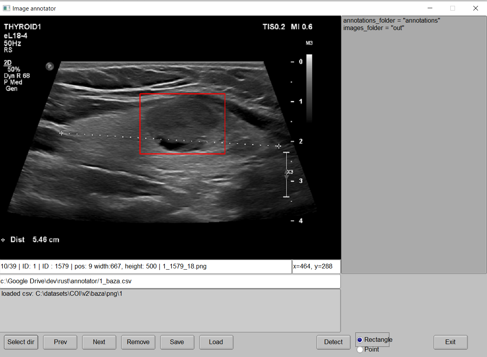

# Annotator

## Overview

Annotator is a free tool for selecting image fragments for computer vision. The program is written in Rust. You can freely use and modify it.

Rust dependencies (for specific versions, check `Cargo.toml'):

* `csv` 
* `fltk`
* `image` 
* `imageproc` 
* `rfd` 
* `serde` 
* `walkdir` 

## Annotator options

The system comes with the following options (buttons):

### Select dir

Select folder containing images. This version supports only PNG image format.

### Prev/Next

Show previous/next image from selected folder.

### Remove

Remove all annoatations from selected image.

### Save

Save all annatations defined for images in selected folder. This button produces following files (*FOLDER* - means selected folder name, *BASE* - means original image filename without extension):

* `FOLDER_baza.csv` - csv file that contains all annotations for images in selected folder
* `/annotations/out_shape_BASE.png` - original image with annoation
* `/out/rec.from_shape_BASE.png` - image containing only selected region. If region is defined by rectangle then this image contains region defined by this rectangle. If region is defined by points, then this image contains a rectangle that describes this shape.

### Load

Loads csv file containing annotations, connected with selected folder.

### Detect

Not used in this version.

### Rectangle/Point selector

Type of annoatation. Rectangle annonation produces rectangle region. Point annotation produces free hand drawing of region.

### Exit

Exits program

## Current known limitations

1. The program only exports data to PNG format
2. Exported files have fixed names and hardcoded structure

## License

Copyright (c) 2023 Mariusz Rafało

Permission is hereby granted, free of charge, to any person obtaining a copy of this software and associated documentation files (the "Software"), to deal in the Software without restriction, including without limitation the rights to use, copy, modify, merge, publish, distribute, sublicense, and/or sell copies of the Software, and to permit persons to whom the Software is furnished to do so, subject to the following conditions:

The above copyright notice and this permission notice shall be included in all copies or substantial portions of the Software.

THE SOFTWARE IS PROVIDED "AS IS", WITHOUT WARRANTY OF ANY KIND, EXPRESS OR IMPLIED, INCLUDING BUT NOT LIMITED TO THE WARRANTIES OF MERCHANTABILITY, FITNESS FOR A PARTICULAR PURPOSE AND NONINFRINGEMENT. IN NO EVENT SHALL THE AUTHORS OR COPYRIGHT HOLDERS BE LIABLE FOR ANY CLAIM, DAMAGES OR OTHER LIABILITY, WHETHER IN AN ACTION OF CONTRACT, TORT OR OTHERWISE, ARISING FROM, OUT OF OR IN CONNECTION WITH THE SOFTWARE OR THE USE OR OTHER DEALINGS IN THE SOFTWARE.